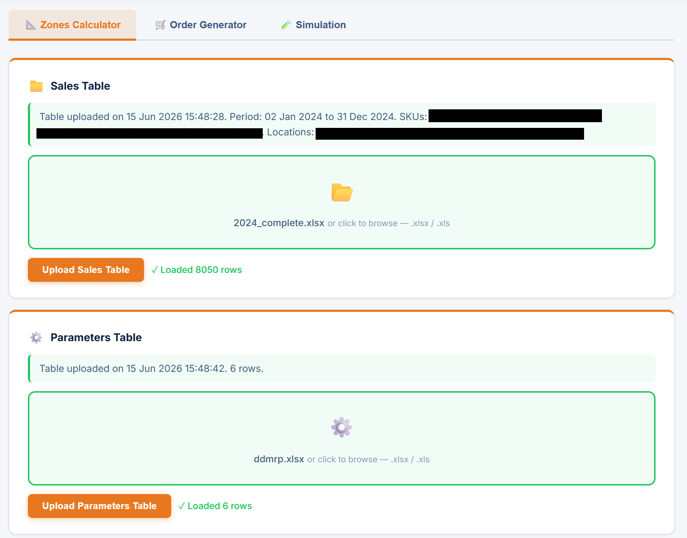
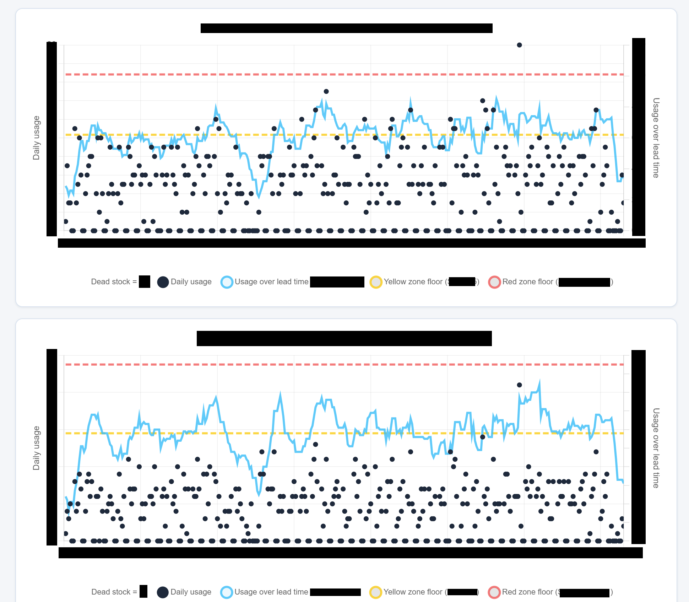
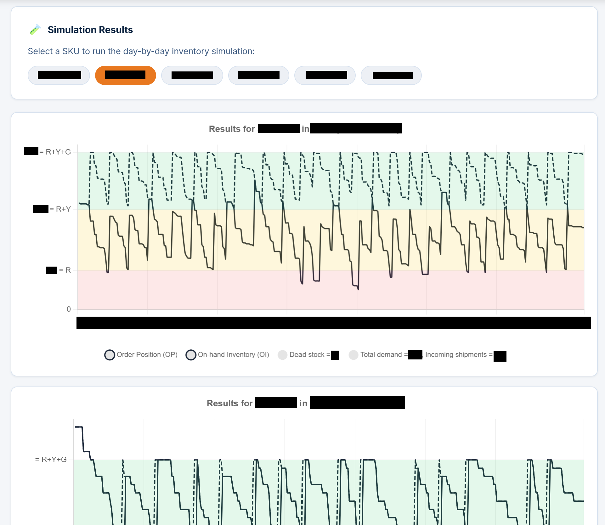

# DDMRP Calculator

> **Note:** This is the public, open-source portion of the project. The private repository contains proprietary client data, internal configuration and final version of the tool that cannot be shared.

A web application implementing a [Demand-Driven MRP](https://ddmrp.com/) restock strategy for an authorized heavy machinery distributor and service provider.

Built in Julia using [Genie.jl](https://genieframework.com/).

## What it does

- **Zones Calculator** — uploads historical sales data and per-SKU parameters, computes DDMRP buffer zones (red / yellow / green), and exports results as `.xlsx`
- **Order Generator** — given current stock levels, determines which SKUs need replenishment and generates an order file
- **Simulation** — replays historical demand against computed buffer zones and renders per-SKU charts

## Documents

- [`stochastic_intro.pdf`](stochastic_intro.pdf) — Mathematical background on the simplified stochastic demand model
- [`cml_presentation.pdf`](cml_presentation.pdf) — Project presentation to management

## Screenshots

The application shown below is a final, unpublished version of the tool.

 

 
